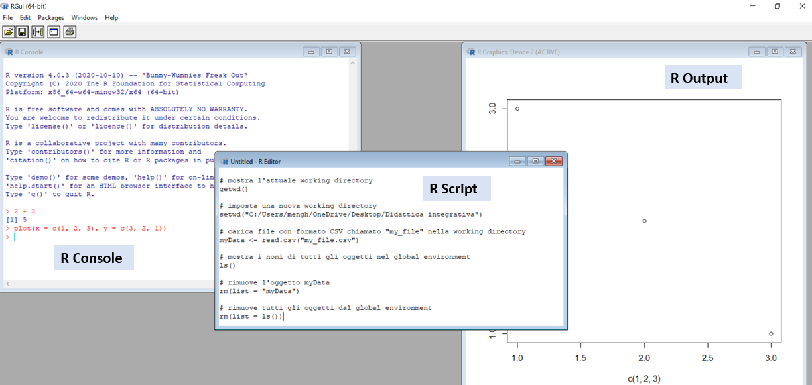
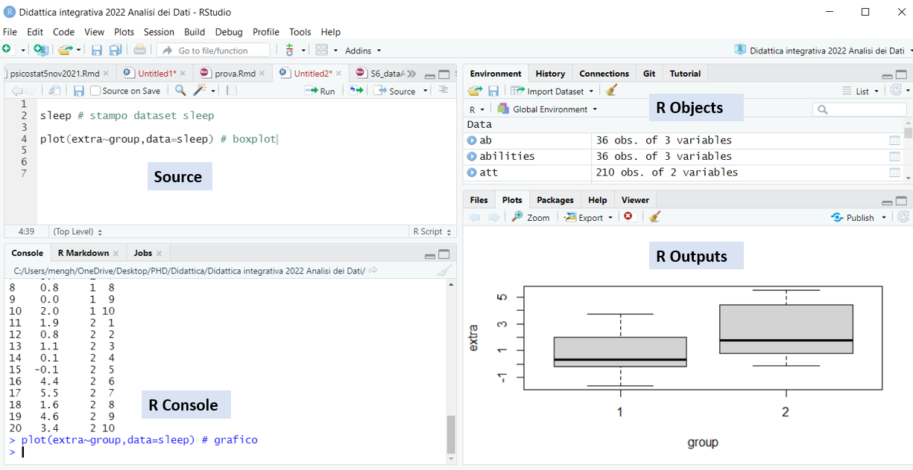

```{r setup, include=FALSE}

knitr::opts_chunk$set(echo = TRUE,tidy.opts = list(width.cutoff=80))
knitr::opts_chunk$set(
  collapse = TRUE,
  comment = NA
)
library(Cairo)

```

## Mi presento

\fontsize{6.5pt}{12}\selectfont

-   **2014: Triennale in Scienze Psicologiche Sociali e del Lavoro** @uniPD \newline \fontsize{5.5pt}{12}\selectfont "*Biofeedback training per la gestione dello stress nei contesti organizzativi*" \fontsize{6.5pt}{12}\selectfont

-   **2016: Magistrale in Psicologia Sociale, del Lavoro e della Com.** @uniPD \newline \fontsize{5.5pt}{12}\selectfont "*Un Protocollo di Assessment Psicofisiologico per la Valutazione del Rischio Stress lavoro-correlato*" \fontsize{6.5pt}{12}\selectfont

-   **2017: Tirocinio post-laurem** presso **Inside Performance** (stress management & biofeedback in contesti organizzativi e sportivi) + **Laboratorio di psicofisiologia** @uniPD (processamento dati e accuratezza sensori actigrafici) &leftarrow; { width=3% }

-   **2017-2021: Dottorato in Scienze Psicologiche** @uniPD \newline \fontsize{5.5pt}{12}\selectfont "*Workplace stress in real time: Towards the psychophysiological assessment of stressors and strain under ecological conditions*" \fontsize{6.5pt}{12}\selectfont

-   **2020: Esperienza di ricerca all'estero** @SRI International (CA, USA) \newline \fontsize{5.5pt}{12}\selectfont Accuratezza e uso Sleep Consumer Technology, Relazioni giornaliere tra sonno e stress \fontsize{6.5pt}{12}\selectfont

-   **2021: Assegno di ricerca** @uniBO \newline \fontsize{5.5pt}{12}\selectfont "*State workaholism as a predictor of daily fluctuations in blood pressure, emotional exhaustion, and sleep quality*"

## Obiettivi delle eseRcitazioni

\fontsize{9pt}{12}\selectfont

-   Acquisire competenze di base nell'uso del software R

-   Consolidare le conoscenze apprese nel corso

-   Implementare le tecniche analitiche apprese durante il corso utilizzando il software R su dataset reali

-   Svolgere insieme gli esercizi propedeutici all'esame \newline

Le slide e tutti materiali usati nelle eseRcitazioni verranno di volta in volta caricati e aggiornati sulla repository all'indirizzo \color{blue}https://github.com/Luca-Menghini/eseRcitazioni

## Programma incontri facoltativi

\fontsize{8pt}{12}\selectfont

- **Giorno 1 (Get started)**: Installare R e RStudio, acquisire confidenza con l'interfaccia del software, e alcuni comandi di base

- **Giorno 2 (R objects)**: Vettori, fattori, matrici e dataframe

- **Giorno 3 (R workspace)**: Worskpace e working directory, caricare un dataset e calcolare le principali statistiche descrittive

- **Giorno 4 (Graphics)**: Visualizzare i dati e interpretare i principali tipi di grafici

- **Giorno 5 (Linear Models)**: Modelli di regressione lineare

- **Giorno 6 (Linear Mixed-Effects and Structural Equation Models)**: Regressione multilivello e path analysis

# Get started

## Il linguaggio R

```{r , echo = FALSE, out.width = "70px",fig.align="center"}

```

\fontsize{7.5pt}{12}\selectfont
- R è un linguaggio e un ambiente di programmazione per il **calcolo statistico** e la **visualizzazione grafica** dei dati

- basato sul 'linguaggio S' (Becker & Chambers, 1984), usato per creare il software S-Plus e poi R, creato da Ross Ihaka e Robert Gentleman, nel 1996

- oggi sviluppato da un gruppo di ricerca internazionale (*R Core Team*), che aggiorna periodicamente (ogni anno) il programma di base (*Base R*)

- progressiva ed esponenziale aggiunta di nuovi pacchetti (*packages*) che ne estendono le funzionalità

## Il linguaggio R

```{r , echo = FALSE, out.width = "70px",fig.align="center"}

```

\fontsize{7.5pt}{12}\selectfont
- ampia varietà di tecniche statistiche (es. modelli lineari e non lineari) e grafiche (es. pacchetto **[ggplot2 - link a lezione dedicata](https://elearning.unipd.it/scuolapsicologia/mod/page/view.php?id=150311)**) 

- pensato per essere **semplice** ma al contempo in grado di generare **output di alta qualità** (grafici, tabelle e report con equazioni e simboli matematici, ecc.); funzioni di default ottimizzate + possibilità di avere il **pieno controllo**

- **software gratuito** (GNU General Public License), **open source** (ogni funzione è documentata e visibile in dettaglio) che funziona su tutti i **principali sistemi operativi**: Windows, MacOS, e UNIX (es. Linux)

- enorme comunità di utenti (per qualsiasi problema, basta googlare ;-))

## Scaricare e installare R

```{r , echo = FALSE, out.width = "70px",fig.align="center"}

```

\fontsize{7.5pt}{12}\selectfont

1. Scaricare R dal sito \color{blue}https://www.r-project.org/ \color{black} \newline CRAN (*Comprehensive R Archive Network*): rete di server che offrono le versioni aggiornate e la relativa documentazione

2. Cliccare sulla voce \color{blue}[CRAN](https://cran.r-project.org/mirrors.html) \color{black} nel menu *Download* a sinistra, selezionare un mirror (es. \color{blue}[il primo](https://cloud.r-project.org/)\color{black}, oppure \color{blue}[quello dell'Università di Padova](https://cran.stat.unipd.it/)\color{black}), quindi il proprio sistema operativo (Linux, MacOS, o Windows)

3. Installare R aprendo il file .exe (Windows) o .pkg (MacOS) appena scaricato, oppure seguire i comandi in base alla propria versione di Linux

## L'interfaccia di Base R

```{r , echo = FALSE, out.width = "300px"}

```

\fontsize{6pt}{12}\selectfont

- **R Console**: per scrivere (`>`) ed eseguire (tasto `Enter`) velocemente dei comandi

- **R Script** (menu `File` > `New R Script`): per scrivere, modificare e salvare sequenze di comandi (salvati con formato .R)

- **Outputs** (es. plot): finestre che si aprono lanciando il relativo comando

## Alcuni comandi elementari

\begincols
  \begincol{.5\textwidth}
  
  \fontsize{6pt}{12}\selectfont
  
Commenti (`#`)
```{r, eval=FALSE}
# questo è un commento
```

Semplici operazioni matematiche
```{r }
2 + 2 # addizione
2 * 2 # moltiplicazione
log(3) # logaritmo naturale
exp(1) # funzione esponenziale
```

Espressioni più lunghe (con **parentesi tonde**)
```{r}
sqrt(5) * ( (4 - 1/2)^2 - pi/2^(1/3) )
```
  
  \endcol
\begincol{.5\textwidth}

  \fontsize{6pt}{12}\selectfont
  
Assegnare valori a degli **oggetti** (`<-`)
```{r }
x <- 3 # creo oggetto 'x' associato al valore 3
x # stampo il valore di x
```

I nomi degli oggetti possono includere lettere, numeri, trattini bassi e punti (es. `pippo`, `pippo32`, `pippo.32`, `pippo_32`)
```{r }
pippo_32 <- x / 3
pippo_32 # stampo il valore di pippo_32
```

**R è sensibile alle maiuscole**! \newline Mentre non è sensible agli spazi
```{r }
3+2
3     +  2
```

  \endcol
\endcols

## Hands on: Operazioni aritmetiche con R

\fontsize{7pt}{12}\selectfont
Calcola il risultato delle seguenti operazioni utilizzando R (\color{blue}[soluzioni](https://github.com/psicostat/Introduction2R/blob/master/exercises/chapter-03-first-comands.R)\color{black}): \newline \fontsize{6pt}{12}\selectfont Source: https://psicostat.github.io/Introduction2R/first-comands.html#esercizi \newline \fontsize{7pt}{12}\selectfont

1. $\frac{(45+21)^3+\frac{3}{4}}{\sqrt{32-\frac{12}{17}}}$

2. $\frac{\sqrt{7-\pi}}{3\ (45-34)}$

3. $\sqrt[3]{12-e^2}+\ln(10\pi)$

4. $\frac{\sin(\frac{3}{4}\pi)^2+\cos(\frac{3}{2}\pi)}{\log_7{e^{\frac{3}{2}}}}$

5. $\frac{\sum_{n=1}^{10} n}{10}$

Extra: Assegna il risultato dell'operazione 4 all'oggetto `x`, il risultato della 5 all'oggetto `y`, e calcola la somma `x + y` 

## RStudio

```{r , echo = FALSE, out.width = "100px",fig.align="center"}
knitr::include_graphics("img/RStudio.PNG")
```

\fontsize{7.5pt}{12}\selectfont
- RStudio è un ambiente di sviluppo integrato per R, che lo integra con un'**interfaccia grafica ottimizzata** per facilitarne l'utilizzo (es. accesso a file e oggetti, grafici, dataset, ecc.) presentando tutto in un'unica finestra

- fondato da J J Allaire nel 2009 (scritto con linguaggio Java e C++), gestito e sviluppato da gruppo di ricerca internazionale (gli stessi di `tidyverse` e `shiny`)

- **gratuito e open source** (GNU General Public License) + versioni a pagamento

## Scaricare e installare RStudio

```{r , echo = FALSE, out.width = "100px",fig.align="center"}
knitr::include_graphics("img/RStudio.PNG")
```

\fontsize{7.5pt}{12}\selectfont

NB: soltanto **dopo** aver installato R

1. Scaricare RStudio dal sito \color{blue}https://rstudio.com \color{black}

2. Cliccare sulla voce \color{blue}[Download](https://www.rstudio.com/products/rstudio/download/) \color{black} nel menu in alto, selezionare la versione gratuita (FREE) di **RStudio Desktop**, quindi il proprio sistema operativo

3. Installare RStudio aprendo il file appena scaricato

## L'interfaccia di RStudio

```{r , echo = FALSE, out.width = "300px"}

```

\fontsize{6pt}{12}\selectfont

- **Source**: R Scripts (`.R`), documenti e presentazioni (`.Rmd`), applicazioni (`.app`), ecc. Per lanciare uno o più comandi, selezionali e premi `Ctrl + Enter` oppure clicca sul tasto `Run` in alto a destra

- **Environment** (oggetti presenti nel workspace) & **History** (storico comandi eseguiti)

## Hands on: Operatori relazionali e logici

\begincols
  \begincol{.5\textwidth}
  
  \fontsize{6pt}{12}\selectfont
  
Operatori relazionali
```{r }
3 == 3 # uguale
3 != 3 # diverso
x >= 3 # maggiore o uguale
5 %in% c(3, 5, 8) # inclusione
```

Operatori logici
```{r }
x <- TRUE
y <- !x # negazione
y
x & (5 < 2) # congiunzione
x | (5 < 2) # disgiunzione inclusiva
```
  
  \endcol
\begincol{.5\textwidth}

  \fontsize{7pt}{12}\selectfont
  
Esercizi sugli operatori relazionali e logici:\newline \fontsize{6pt}{12}\selectfont Source: https://psicostat.github.io/Introduction2R/first-comands.html#esercizi \newline
  
1. Definisci una proposizione per valutare la seguente condizione: “x è un numero compreso tra -4 e -2 oppure è un numero compreso tra 2 e 4”

2. Definisici due relazioni false e due vere che ti permettano di valutare i risultati di tutti i possibili incroci che puoi ottenere con gli operatori logici `&` e `|`

3. Esegui le seguenti operazioni `4 ^ 3 %in% c(2,3,4)` e `4 * 3 %in% c(2,3,4)`. Cosa osservi nell’ordine di esecuzione degli operatori?

  \endcol
\endcols

## Oggetti e funzioni

\fontsize{7pt}{12}\selectfont
- **Oggetti**: identificano dei valori salvati nel workspace (`Environment`); i valori vengono assegnati agli oggetti con il simbolo `<-` (minore e meno); per richiamare un oggetto è sufficiente scrivere il suo nome
```{r }
pippo_32 <- 2 # assegno valore a oggetto
pippo_32 # stampo oggetto
pippo_32 <- pippo_32 + 1 # aggiorno oggetto
pippo_32
```

\fontsize{7pt}{12}\selectfont
- **Funzioni**: etichette associate a sequenze di comandi programmati per restituire uno specifico output (chiamato **valore**) sulla base di uno o più input (chiamati **argomenti**); il nome della funzione è sempre seguito dalle parentesi tonde, entro le quali si impostano gli argomenti (spesso ci sono dei valori di default)
```{r }
sqrt(x = 9) # radice quadrata dell'argomento x
seq(from = 1, to = 5) # sequenza numerica dal valore 'from' al valore 'to' 
```

## Tipi (classi) di oggetti

\begincols
  \begincol{.5\textwidth}
  
  \fontsize{6pt}{12}\selectfont
  
**Logical** (logico)
```{r }
x <- TRUE
x <- T
class(x)
```

**Numeric** (numeri)
```{r }
x <- 1.4
class(x)
```

**Integer** (numeri interi)
```{r }
as.integer(x)
```

**Character** (stringa di testo)
```{r }
x <- "Mi    piace R"
x
``` 
  
  \endcol
\begincol{.5\textwidth}

  \fontsize{7pt}{12}\selectfont
  
**Vector** (vettore): serie di valori con la stessa classe (es. numeric) combinati con la funzione `c()` (combine)
```{r }
x <- c(1, 10.5, 3, 2)
x + 1
sqrt(x)
y <- c("mi","piace", "R")
```

**Matrix** (matrice): tabella `nrow * ncol`
```{r }
x <- matrix(1:12, nrow = 3, ncol = 4)
rownames(x) <- y # nomi di riga
x
```

  \endcol
\endcols

# R objects

## Tipi (classi) di oggetti: vector

\fontsize{7pt}{12}\selectfont
Un vettore (*vector*) è una **sequenza di elementi dello stesso tipo** (classe), che può essere creata con la funzione **`c()`** (*combine*) o con altre funzioni.
```{r }
x <- c(1, 10.5, 3, 2) # creo vettore numerico
y <- 1:10 # un altro vettore numerico
(z <- rep(c(TRUE, FALSE), each = 2)) # vettore logico
as.character(x) # converte la classe del vettore da numeric a character
as.numeric(z) # da logical a numeric (FALSE = 0, TRUE = 1)
```

Applicando un'operazione o una funzione al vettore, questa viene applicata a tutti i suoi elementi.
```{r }
y*2 # moltiplica tutti i valori per 2
round(sqrt(y), 2) # rad. quadrata dei valori di y, arrotondati a 2 decimali
```

## Tipi (classi) di oggetti: vector

\fontsize{7pt}{12}\selectfont
Alcune funzioni restituiscono un unico valore a partire da un vettore di valori.
```{r }
length(y) # numero di elementi nel vettore
```
Ad esempio, per calcolare delle **statistiche descrittive su vettori numerici**:
```{r }
sum(y) # somma gli elementi nel vettore
max(y) # valore massimo
mean(y) # media
median(y) # mediana
var(y) # varianza
sd(y) # deviazione standard
```

## Tipi (classi) di oggetti: vector

\fontsize{7pt}{12}\selectfont
Le **parentesi quadre** `[ ]` permettono di **selezionare uno o più elementi** del vettore.
```{r }
pippo32 <- c("uno", "due", "tre", "quattro", "cinque") # vettore di caratteri
pippo32[3] # seleziono il terzo valore di pippo32
pippo32[3:4] # terzo e quarto valore del vettore pippo32
pippo32[c(4, 2)] # quarto e secondo valore (non scrivere pippo32[4,3] !)
```
Ad esempio, si possono selezionare gli **elementi che rispettano certe condizioni**, usando gli operatori logici e relazionali:
```{r }
y[y <= 3 | y > 8] # valori di y minori o uguali a 3 o maggiori di 8
pippo32[pippo32 != "due"] # valori di pippo32 diversi da "due"
pippo32[substr(pippo32, 2, 2) == "u"] # valori con lettera "u" in 2a posizione
```

## Tipi (classi) di oggetti: vector

\fontsize{7pt}{12}\selectfont
La funzione `which()` restituisce la **posizione** degli elementi per cui è vera una condizione specifcata.
```{r }
substr(pippo32, 2, 2) == "u" # testa l'equivalenza per ogni elemento
which(substr(pippo32, 2, 2) == "u") # elementi con equivalenza TRUE
pippo32[substr(pippo32,2,2)=="u"] == pippo32[which(substr(pippo32,2,2)=="u")]
```
Per **cambiare** uno o più elementi di un vettore, usa il simbolo `<-`
```{r }
pippo32[1] <- "UNO!"
```

Per **eliminare** uno o più elementi da un vettore, usa il simbolo `-`
```{r }
pippo32[-c(2, 4)]
```

Hands on: \color{red} **Esercizio 1.5** \color{black} \fontsize{5.5pt}{12}\selectfont (Moodle > ADcom2122 > Materiale Didattico > MateRiale eseRcizi)

## Tipi (classi) di oggetti: factor

\fontsize{7pt}{12}\selectfont
Un fattore (*factor*) è un tipo speciale di vettore usato in R per lavorare con le **variabili categoriali** (nominali o ordinali). I valori possibili assunti dal fattore sono chiamati **livelli** (*levels*), di default ordinati in ordine crescente (numerico o alfabetico).

\begincols
  \begincol{.5\textwidth}
  
  \fontsize{6pt}{12}\selectfont
```{r }
as.factor(pippo32) # da character a factor
# summary() mostra un sommario della variabile
summary(pippo32) 
# per i fattori, mostra la freq. di ogni livello
summary(as.factor(pippo32)) # equivale a table()
``` 
  
  \endcol
\begincol{.5\textwidth}

  \fontsize{6pt}{12}\selectfont
```{r }
(y <- rep(c(2,4,6),3))
as.factor(y) # da numeric a factor
summary(y)
summary(as.factor(y)) 
```

  \endcol
\endcols

## Tipi (classi) di oggetti: factor

\begincols
  \begincol{.5\textwidth}
  
  \fontsize{6pt}{12}\selectfont
  
Creare un fattore con la funzione `factor()`:
```{r }
factor(x = c("C",rep("A",3),c("B","A","C")))
(x <- factor(x = c("C","A","B","A"), # vettore
             levels = c("C","A","B"))) # livelli

levels(x) # levels() stampa i nomi dei livelli
factor(x, levels=c("B","A","C")) # cambia ordine
levels(x) <- c("Uno","Due","Tre") # cambia nomi
x
```
  
  \endcol
\begincol{.5\textwidth}

  \fontsize{6pt}{12}\selectfont
  
Quando si lavora con **variabili ordinali**, è possibile specificare l'ordine dei livelli impostando l'argomento `ordered = TRUE`. Viene così generato un **fattore ordinato**, sempre seguendo l'ordine definito da `levels`.
```{r }
# fattore non ordinato (default)
factor(x = c("Maria","Mauro","Teresa","Carlo"))

# fattore ordinato (default: ordine alfabetico)
factor(x = c("Maria","Mauro","Teresa","Carlo"),
       ordered = TRUE)
```

Hands on: \color{red} **Esercizio 1.8**

  \endcol
\endcols

## Tipi (classi) di oggetti: matrix

\fontsize{7pt}{12}\selectfont
Una matrice (*matrix*) è una **struttura bidimensionale (`nrow*ncol`) di elementi dello stesso tipo**, che può
essere creata con la funzione: \newline `matrix(data, nrow = , ncol = , byrow = FALSE)`

\begincols
  \begincol{.5\textwidth}
  
  \fontsize{6pt}{12}\selectfont
```{r }
(x <- matrix(1:12, nrow = 3, ncol = 4))
matrix(1:12, nrow = 3, ncol = 4, byrow = TRUE)
matrix(c("Mar","Mau","Ter","Car"), nrow = 2)
``` 
  
  \endcol
\begincol{.5\textwidth}

  \fontsize{6pt}{12}\selectfont
  
Per **selezionare uno o più elementi** di una matrice, usamo ancora una volta le **parentesi quadre**, ma questa volta con la sintassi `nome_matrice[num_riga, num_colonna]`
```{r }
x[1,2] # prima riga, seconda colonna
x[2,1] # seconda riga, prima colonna
x[1:3,2] # righe 1-3, seconda colonna
x[1,] # prima riga, tutte le colonne
x[,2] # seconda colonna, tutte le righe
```

  \endcol
\endcols

## Tipi (classi) di oggetti: matrix

\begincols
  \begincol{.5\textwidth}
  
  \fontsize{6pt}{12}\selectfont
  
```{r }
x
``` 
  
Unire due matrici:
```{r }
cbind(x,matrix(rep(3,6),nrow=3)) # per colonna
rbind(x,matrix(rep(3,4),ncol=4)) # per riga
``` 

  \endcol
\begincol{.5\textwidth}

  \fontsize{6pt}{12}\selectfont

Nomi e numero di righe e colonne:
```{r }
rownames(x) <- c("a","b","c") # nomi righe
colnames(x) <- 1:4 # nomi colonne
x
c(nrow(x),ncol(x)) # numero righe e col. = dim(x)
t(x) # matrice trasposta (inverte righe e col.)
``` 
Hands on: \color{red} **Esercizio 1.6**

  \endcol
\endcols

## Strutture di dati: dataframe

\fontsize{7pt}{12}\selectfont
Un dataframe è una **struttura bidimensionale di elementi di diverso tipo** \newline (es. numeric, character e factor), che può
essere creata con la funzione: \newline `data.frame(nome_variabile1 = c(...), nome_variable2 = c(...), ...)`

\begincols
  \begincol{.5\textwidth}
  
  \fontsize{6pt}{12}\selectfont
```{r }
(x <- data.frame(Num = 1:4,
                 Char = c("a","b","c","d"),
                 Logi = rep(c(TRUE,FALSE),2)))
str(x) # struttura del dataframe
``` 
  
  \endcol
\begincol{.5\textwidth}

  \fontsize{6pt}{12}\selectfont
  
Mentre il comando `str(nome_df)` restituisce la struttura di un dataframe, `summary(nome_df)` stampa un sommario per ogni variabile.
```{r }
summary(x)
```

  \endcol
\endcols

## Strutture di dati: dataframe

\fontsize{7pt}{12}\selectfont
La **manipolazione di un dataframe** è molto simile a quella già vista per le matrici.

\begincols
  \begincol{.5\textwidth}
  
  \fontsize{6pt}{12}\selectfont
Selezione elementi e unione di due dataframe:
```{r }
x[2, 2:3] # seconda riga, colonne 2 e 3
cbind(x,data.frame(new=4:1)) # unione per colonna
rbind(x[1:3,],data.frame(Num=10, # per riga
                         Char="z",Logi=FALSE))
``` 
  
  \endcol
\begincol{.5\textwidth}

  \fontsize{6pt}{12}\selectfont
  
Nomi e numero di righe e colonne:
```{r }
rownames(x) # default = 1:nrow(x)
colnames(x)[2] # nome colonna 2
nrow(x)
ncol(x)
``` 

Trasporre un dataframe:
```{r }
t(x)
```

  \endcol
\endcols

## Strutture di dati: dataframe

\begincols
  \begincol{.5\textwidth}
  
{ width=25% } 
  
  \fontsize{6pt}{12}\selectfont
Per selezionare una colonna (vettore) di un dataframe, si può usare il simbolo `$`, con la sintassi `nome_dataframe$nome_colonna`:
```{r }
x$Char # seleziono colonna Char
x$Char[2] # secondo elemento della colonna Char
x$Char[2] == x[2,2] # due comandi equivalenti
x$Char <- NULL # elimino colonna Char
x[x$Num < 3,] # seleziono casi con Num < 3
# stesso risultato con subset(x, Num < 3)
``` 
  
  \endcol
\begincol{.5\textwidth}

  \fontsize{6pt}{12}\selectfont
  
Modo alternativo di selezionare le colonne:
```{r }
x[,"Logi"]
x[1:2,c("Num","Logi")]
``` 

"Testa" e "coda" di un dataframe:
```{r }
head(x, n = 2) # prime due righe
tail(x, 1) # ultima riga
```

Hands on: \color{red} **Esercizio 1.9**

  \endcol
\endcols

## Strutture di dati: list

\fontsize{7pt}{12}\selectfont
Una lista (*list*) è una **raccolta di oggetti** che possono avere **diversa classe** (es. vector, matrice e dataframe) e **diversa lunghezza** (al contrario di matrici e dataframe). Si tratta della struttura più complessa eversatile di R, e si crea con la funzione \newline `list(nome_oggetto1 = ..., nome_oggetto2 = ..., ...)` 

\begincols
  \begincol{.5\textwidth}
  
  \fontsize{6pt}{12}\selectfont
```{r }
x <- list(Num = 1:4,
          Matr = matrix(1:12, nrow=3),
          df = x,
          lst = list(1:3,2:3))
str(x) # struttura del dataframe
``` 
  
  \endcol
\begincol{.5\textwidth}

  \fontsize{6pt}{12}\selectfont
  
Per **selezionare gli elementi** di una lista, usiamo sempre le **parentesi quadre**
```{r }
x[1] # singole = crea sotto-lista
class(x[1])
x[[1]] # doppie = estrae l'oggetto
class(x[[1]])
x[[3]][2,1]
```

  \endcol
\endcols

# R workspace

## Funzioni e pacchetti

\fontsize{6pt}{12}\selectfont
Molte cose in R si fanno usando delle funzioni, composte dai seguenti elementi: **nome**, **parentesi tonde**, **argomenti** (`nomeArgomento = valoreArgomento` oppure senza nome, in base alla posizione di default), valore restituito (*value*)

```{r }
sqrt(x = c(1,2,3))
sqrt(c(1,2,3))
```

**R Help system**: Per conoscere i dettagli (argomenti) di qualsiasi funzione, basta inserire il simbolo `?` seguito dal nome della funzione
```{r eval=FALSE}
?sqrt
```

**R packages**: Per ottenere funzioni aggiuntive rispetto a quelle dei pacchetti di base, è necessario installare e aprire il relativo pacchetto (**package**)
```{r eval=FALSE}
install.packages("nome_pacchetto") # installare un pacchetto
library(nome_pacchetto) # apripre un pacchetto
nome_pacchetto::nome_funzione() # usare funzione senza aprire il pacchetto
```

## Oggetti, funzioni e workspace

\fontsize{7pt}{12}\selectfont
Quando assegnamo un valore ad una variabile, questa viene registrata nel **workspace**: il posto che contiene tutti gli oggetti e le funzioni definiti dall'utente (sezione Environment di RStudio).

La funzione `ls()` stampa i nomi di tutti gli oggetti e le funzioni presenti nel workspace, mentre la funzione `rm()` rimuove l'oggetto specificato tra parentesi:
```{r echo=FALSE}
rm(list=ls())
```
```{r }
x <- 1 # assegno valore a x
y <- 2 # assegno valore a y
ls() # mostra tutti gli oggetti nel workspace
rm(y) # rimuove l'oggetto y
ls()
```

Combinando le due funzioni, il comando **`rm(list=ls())`** svuota il workspace, eliminando tutti gli oggetti e le funzioni (molto utile **all'inizio di ogni script!**)
```{r }
rm(list = ls())
```

## Oggetti e funzioni già inclusi in Base R

\fontsize{7pt}{12}\selectfont

Alcuni pacchetti di base (oggetti e funzioni) sono **già installati in R**. Questi non richiedono l'apertura di nessun pacchetto e non compaiono nel workspace.
```{r }
rm(list=ls()) # svuoto il workspace
head(sleep,4) # dataset sleep dal pacchetto datasets
mean(sleep$extra) # funzione mean() dal pacchetto base
letters[2] # costanti dal pacchetto base
ls() # il workpace è vuoto!
```

## Caricare oggetti dall'esterno: La working directory

\fontsize{7pt}{12}\selectfont

Per aprire un file che si trova in una specifica cartella, è necessario prima impostare la **working directory**, ovvero la cartella dalla quale vengono importati i file di input e nella quale vengono esportati i file di output.
```{r }
getwd() # funzione per stampare la WD attuale
dir()[1:3] # stampa i primi 3 file nella WD
```
```{r eval=FALSE}
setwd("data") # sottocartella nella WD
setwd("C:/Users/mengh/OneDrive/Desktop") # nuova directory
```

**Trucchetto con RStudio**: ogni volta che inizi un nuovo progetto (es. analisi tesi, report progetto), crea un nuovo **R project** (`.Rproj`) dal menu `File > New R Project`, selezionando una directory esistente o creandone una nuova. Così quella sarà già impostata come la WD per tutti i file associati al progetto.

## Caricare ed esportare un dataset

\fontsize{7pt}{12}\selectfont

Il primo passo di ogni analisi dei dati con R è quello di caricare una struttura di dati (registrati con un certo metodo e salvati con un certo formato) nel workspace.

Per caricare un dataset che si trova nella working directory, è necessario usare una specifica funzione in base al formato del file.
```{r eval=FALSE}
# file .RData
load(file = "data/questionarioStudenti.RData") # import
save(qs, file = "data/questionarioStudenti.RData") # export
```

R può importare ed esportare dati salvati con molti formati diversi, alcuni dei quali richiedono l'installazione di pacchetti aggiuntivi.
```{r eval=FALSE}
# file .CSV (comma separated values)
qs <- read.csv(file = "data/questionarioStudenti.csv") # import
write.csv(x = qs,"data/questionarioStudenti.csv", row.names = FALSE) # export

# file .SAV (da SPSS)
library(foreign)
qs <- read.spss("data/questionarioStudenti.sav", to.data.frame=TRUE)
```

## Caricare ed esportare un dataset

\fontsize{7pt}{12}\selectfont

Un modo veloce (ma poco riproducibile!) per caricare un file su R è usare la funzione **`file.choose()`** al posto del nome del file. Questo consente di caricare un file senza nemmeno dover impostare la WD.
```{r eval=FALSE}
qs <- read.csv(file = file.choose())
```

Se hai dubbi su quale funzione usare per leggere un file, puoi usare il menu punta-e-clicca di RStudio: `File` > **`Import Dataset`** \newline

\color{red} Hands on: 

- Apri o crea un file `.xlsx` sul tuo PC, salvalo in formato **`.csv`** (comma separated values) e importalo su R
- Prova ad importare direttamente il file **`.xlsx`** (se hai dubbi, cerca su Google \newline "*how to read xlsx file with R*")
- In entrambi i casi, osserva la classe e la struttura dell'oggetto importato

## Hands on: Questionario incontri facoltativi

\fontsize{6.5pt}{12}\selectfont

1. Scarica i file `questionarioStudenti.RData` e `questionarioStudenti.csv` da Github: \newline \color{blue} https://github.com/Luca-Menghini/eseRcitazioni/tree/main/data \color{black} (Premere su `File` > `Raw` > `Download` o tasto dx > `Save as`), salva il file in una cartella e imposta quella cartella come working directory.

3. Importa entrambi i file su RStudio e confronta i due oggetti. Di che classe sono? E le variabili di che classe sono?

4. Usa la funzione `describe()` del pacchetto `psych` (forse va prima installato!) per calcolare le statistiche descrittive della variabile `numVar` e usa la funzione `hist()` per visualizzare il grafico di densità ad istogrammi (prova a cambiare il valore dell'argomento `breaks`).

5. Usa la funzione `table()` per produrre la tabella di frequenza della variabile `Q02` ("*Quale giorno preferiresti per gli incontri facoltativi?*")

6. Ora fai la stessa cosa, ma considerando solo chi ha risposto "Sì" alla domanda `Q01` ("*Parteciperai a tutti gli incontri?*")

7. Ora incrocia le frequenze delle variabili `Q02` e `Q03` ("*Riusciresti a partecipare anche se fossero nel giorno che NON hai scelto?*")

## Statistiche descrittive (univariate)

\fontsize{6pt}{12}\selectfont

\begincols
  \begincol{.5\textwidth}
```{r }
x <- c(1,1,1,2,8,9) # creo vettore numerico
```
```{r }
c(mean(x),median(x)) # media & mediana
as.numeric(which.max(table(x))) # moda
c(var(x),sd(x)) # varianza & dev. standard
quantile(x,probs=0.90) # 90° percentile
quantile(x,probs=c(0.25,0.50,0.75,1)) # quartili
round(rank(x)/length(x),2) # ranghi percentili
``` 
  
  \endcol
\begincol{.5\textwidth}

  \fontsize{6pt}{12}\selectfont
  
```{r }
table(x) # frequenze assolute
round(table(x)/length(x),2) # freq relative
cumsum(x) # somma cumulata
cumsum(table(x)) # freq cumulate assolute
round(cumsum(table(x)/ # freq cumulate relative
               length(x)),2) 
``` 

  \endcol
\endcols

## Statistiche descrittive (bivariate)

\fontsize{6pt}{12}\selectfont

\begincols
  \begincol{.55\textwidth}
```{r }
y <- -x - 1 # valori inversamente prop. a x
z <- round(rnorm(n=length(x)),1) # valori a caso
(df <- data.frame(x,y,z)) # nuovo dataframe
```

Correlazione e covarianza
```{r }
cov(x,y) # covarianza tra x e y
cor(x,y) # correlazione
``` 
  \endcol
\begincol{.45\textwidth}

\fontsize{6pt}{12}\selectfont`

Quando ho più di due variabili:
```{r }
cov(df) # matrice di covarianza

cor(df) # matrice di correlazione
```

  \endcol
\endcols

## Esercizi

\fontsize{8pt}{12}\selectfont
 
- **Esercizio 1.10***

- **Esercizi 1.11-1.13***

- **Esercizio 1.26**** \newline

\fontsize{6.7pt}{12}\selectfont

*I dataset sono inclusi nella cartella `dati.esercizi.zip` su Moodle \newline (`ADcom2122` > `Materiale didattico` > `MateRiale eseRcizi`), ma si possono scaricare \newline anche da \color{blue} [github.com/Luca-Menghini/eseRcitazioni/tree/main/data](https://github.com/Luca-Menghini/eseRcitazioni/tree/main/data) \color{black}

**Per scaricare il pacchetto `ADati` del prof. Pastore, esegui i seguendi comandi collegandoti ad una rete wifi:
```{r eval=FALSE}
install.packages("devtools") # installo pacchetto devtools
library(devtools) # apro pacchetto devtools
install_github("https://github.com/masspastore/ADati") # installo ADati da github
library(ADati) # apro pacchetto ADati
```

# Graphics

## Graphics in R: Principali funzioni

\begincols
  \begincol{.55\textwidth}

\fontsize{8pt}{12}\selectfont  

Funzioni di alto livello \newline (stanno in piedi da sole)

\fontsize{6pt}{12}\selectfont  
```{r eval=FALSE}
# funzione base (dipende dalla classe dell'oggetto)
plot() # scatter plot (grafico a dispersione)

# distribuzione
boxplot() # boxplot (diagramma a scatola e a baffi)
qqnorm() # quantile-quantile plot

# frequenze
barplot() # grafico a barre (variabili categoriali)
hist() # istogramma (variabili continue)
pie() # pie chart

# interazioni
interaction.plot()
``` 
  \endcol
\begincol{.45\textwidth}

\fontsize{8pt}{12}\selectfont  

Funzioni di basso livello \newline (aggiungono elementi alle prime)

\fontsize{6pt}{12}\selectfont  
```{r eval=FALSE}
points() # aggiunge punti
lines() # aggiunge linee
text() # aggiunge del testo

# retta di regressione lineare
abline(a = ..., b = ...)

# elementi più complessi
rect() # aggiunge rettangoli
polygon() # aggiunge poligoni

# altre caratteristiche del grafico
axis() # per modificare gli assi
legend() # per aggiungere una legenda
```

  \endcol
\endcols

## Parametri grafici

\fontsize{7pt}{12}\selectfont  

Esegui il comando `?par` per vedere tutti i parametri grafici modificabili.

\begincols
  \begincol{.55\textwidth}

\fontsize{7pt}{12}\selectfont

Alcuni possono essere impostati usando gli argomenti delle funzioni grafiche:

\fontsize{6pt}{12}\selectfont  
```{r eval=FALSE}
# dimensioni
cex = 2 # grandezza testo e simboli (moltiplicatore)
lwd = 0.5 # spessore linee

# colore e forma
col = "red" # (vedi ?colors)
lty = 2 # tipo di linee (1=solid, 2=dashed, ...)
pch = 19 # forma dei punti (vedi ?points)

# titoli
main = "Titolo del grafico"
xlab = "Titolo asse x"
``` 
  \endcol
\begincol{.45\textwidth}

\fontsize{7pt}{12}\selectfont  

Altri devono essere impostati all'interno della funzione `par()`, che va eseguita prima di generare il grafico:

\fontsize{6pt}{12}\selectfont  
```{r eval=FALSE}
# margini (bottom,left,top,right)
mai # dimensione margini (in ince)
mar # dimensione margini (in linee di testo)

# struttura griglie di grafici
mfrow=c(nrow, ncol) 
# es. due grafici uno di fianco all'altro
mfrow=c(2,1) 
# es. due grafici uno sotto l'altro
mfrow=c(1,2) 
```

  \endcol
\endcols

## Distribuzioni univariate: variabili continue

\fontsize{6pt}{12}\selectfont  
```{r fig.width=6,fig.height=2.8}
X <- rnorm(n=100, mean=0, sd=1) # genero valori casuali dalla distribuzione normale standard
par(mfrow = c(2,2), mai = c(0.3,0.5,0.2,0.5)) # voglio 4 grafici in una sola finestra
plot(X) # scatter plot: grafico a dispersione (variabilità)
hist(X) # istogramma: distribuzione di frequenze per classi
boxplot(X) # box plot: diagramma a scatola (1° e 3° quartile) e a baffi (+/- 1.5 IQR)
qqnorm(X) # Q-Q plot: distribuzione cumulata di X vs. distribuzione cumulata normale)
``` 

## Distribuzioni univariate: variabili categoriali

\fontsize{6pt}{12}\selectfont  
```{r fig.width=6,fig.height=2.8}
Y <- factor(sample(x=c("A","B","C"),size=100,replace=TRUE)) # frequenze casuali per A, B e C
par(mfrow = c(2,2), mai = c(0.3,0.5,0.2,0.5)) # voglio 4 grafici in una sola finestra
barplot(table(Y), main="Frequenze assolute") # grafico a barre: mostra le frequenze assolute
barplot(round(cumsum(table(Y)/length(Y)),2), main="Frequenze cumulate relative")
barplot(table(Y)) # stesso grafico ma aggiungo del testo in blu
text(x=c(0.7,1.9,3.1),y=10,labels=c("gruppo A","gruppo B","gruppo C"),col="blue",cex=0.7)
``` 

## Valutare la normalità di una distribuzione

\begincols
  \begincol{.5\textwidth}

\fontsize{6pt}{12}\selectfont  
```{r fig.width=2.5,fig.height=2.6}
X <- rnorm(n = 1000, mean = 60, sd = 20) # norm
par(mfrow=c(2,1),mai=rep(0.3,4),mar=rep(1.8,4))
hist(X,main="",xlab="",ylab="") # istogramma
qqnorm(X,cex=0.5,main="",pch=20) # Q-Q plot
qqline(X,col="red") # aggiungo linea distr. norm.
``` 
  \endcol
\begincol{.5\textwidth}

\fontsize{7pt}{12}\selectfont  

\fontsize{6pt}{12}\selectfont  
```{r fig.width=2.5,fig.height=2.6}
Y <- runif(n=1000,min=min(X),max=max(X)) # unif
par(mfrow=c(2,1),mai=rep(0.3,4),mar=rep(1.8,4))
hist(Y,main="",xlab="",ylab="") # istogramma
qqnorm(Y,cex=0.5,main="",pch=20) # Q-Q plot
qqline(Y,col="red") # aggiungo linea distr. norm.
```  

  \endcol
\endcols

## Valutare la normalità di una distribuzione

\begincols
  \begincol{.5\textwidth}

\fontsize{6pt}{12}\selectfont  
```{r }
# Distribuzione empirica
hist(X, freq = FALSE)
# Distribuzione teorica (attesa)
curve(dnorm(x, mean = 60, sd = 20),
      from = min(X), to = max(X),
      col = "red", lwd = 2,
      add = TRUE) 
``` 
  \endcol
\begincol{.5\textwidth}

\fontsize{6pt}{12}\selectfont  
```{r }
# Distribuzione empirica
hist(Y, freq = FALSE, ylim = c(0,0.02))
# Distribuzione teorica (attesa)
curve(dnorm(x, mean = 60, sd = 20),
      from = min(Y), to = max(Y),
      col = "red", lwd = 2,
      add = TRUE)
```  

  \endcol
\endcols

## Valutare la normalità di una distribuzione

\begincols
  \begincol{.5\textwidth}

\fontsize{6pt}{12}\selectfont  
```{r fig.width=2.5,fig.height=2.6}
library(moments) # asimmetria e curtosi
c(skewness(X), kurtosis(X)) # (buono se ~ 0)
# test Kolmogorov-Smirnov (H0: X è normale)
ks.test(X, y="pnorm", mean=mean(X), sd=sd(X)) 
# test Shapiro-Wilk (H0: X è normale)
shapiro.test(X) 
``` 
  \endcol
\begincol{.5\textwidth}

\fontsize{6pt}{12}\selectfont  
```{r fig.width=2.5,fig.height=2.6}
# asimmetria e curtosi
c(skewness(Y), kurtosis(Y)) # (buono se ~ 0)
# test Kolmogorov-Smirnov (H0: Y è normale)
ks.test(Y, y="pnorm", mean=mean(Y), sd=sd(Y)) 
# test Shapiro-Wilk (H0: Y è normale)
shapiro.test(Y) 
```  

  \endcol
\endcols

## Distribuzioni bivariate: variabili continue

\begincols
  \begincol{.6\textwidth}

\fontsize{6pt}{12}\selectfont  
```{r fig.width=1.8,fig.height=1.8,fig.align='center'}
Y <- rnorm(1000, mean=20, sd=1) # Y (indipendente da X)
Z <- X + rnorm(1000, sd = 20) # Z (proporzionale a X)
# Scatter plot
par(mfrow=c(2,1),mai=rep(0.3,4),mar=rep(1.8,4),cex=.5)
plot(X, Y, main = paste("XY r =",round(cor(X, Y),2)))
abline(lm(Y~X),col="red") # retta di regr. lineare
plot(X, Z, main = paste("XZ r =",round(cor(X, Z),2)))
abline(lm(Z~X),col="red") # tilde (~) con Alt + 1-2-6
``` 

  \endcol
\begincol{.4\textwidth}

\fontsize{6pt}{12}\selectfont  
```{r message=FALSE,out.width='170px'}
df <- data.frame(X, Y, Z, P = -Z)

# Correlation plot
library(corrplot)
corrplot(cor(df),method="color",
         tl.cex=2,cl.cex=1,
         mar = c(0,0,0,15))
```

  \endcol
\endcols

## Distribuzioni bivariate: variabili categoriali

\fontsize{6pt}{12}\selectfont  
```{r }
# creo data.frame con sesso (M/F) e livello di educazione (primaria, medie, superiori, università)
df <- data.frame(sex = sample(x = rep(c("F","M"),50), size = 100),
                 edu = sample(x = rep(c("prim","med","sup","uni"),25), size = 100))
``` 

\begincols
  \begincol{.6\textwidth}

\fontsize{6pt}{12}\selectfont  
```{r fig.width=4.2,fig.height=3.2,out.width='70%',fig.align='center'}
table(df) # frequenze incrociate
par(mai=rep(0.4,4))
barplot(table(df),legend.text = TRUE) # bar plot
``` 

  \endcol
\begincol{.4\textwidth}

\fontsize{6pt}{12}\selectfont  
```{r fig.width=5,fig.height=4}
# versione con 'gruppi affiancati'
par(mai=rep(0.4,4))
barplot(table(df),legend.text = TRUE,
        beside = TRUE)
```

  \endcol
\endcols

## Distribuzioni bivariate: continue & categoriali

\fontsize{6pt}{12}\selectfont  
```{r fig.width=7,fig.height=3.5,out.width='80%',warning=FALSE,message=FALSE}
par(mfrow = c(2,2), mai = c(0.5,1,0.2,0.5)) # nota: uso il dataset sleep (già incluso in R base)
barplot(tapply(sleep$extra, sleep$group, FUN=mean), # grafico a barre x le medie (SCONSIGLIATO!)
        main="SCONSIGLIATO!",cex.main=1.5, ylab = "extra"); abline(a=0,b=1,col="red",lwd=2)
hist(sleep[sleep$group==1,"extra"], breaks=10, col = rgb(0,0,1,alpha=0.5),  
     xlim = c(min(sleep$extra), max(sleep$extra)), xlab="", main="") # istogramma per gruppo
hist(sleep[sleep$group==2,"extra"], breaks=10, col = rgb(1,0,0,alpha=0.5), add = TRUE)
boxplot(extra ~ group, data = sleep) # box plot per gruppo
library(vioplot); vioplot(extra ~ group, data = sleep) # grafico a violino: densità per gruppo
``` 

## Salvare un grafico

\begincols
  \begincol{.55\textwidth}

\fontsize{6pt}{12}\selectfont  
```{r }
# 1. apro nuovo file con formato PNG
png(filename = "graFico.png", # titolo del grafico
    width = 350, height = 350) # larghezza e altezza

# 2. creo il grafico
plot(sleep$group, sleep$extra, 
     xlab = "group", ylab = "extra", col = "#2E9FDF")

# 3. chiudo il file
dev.off()
``` 

  \endcol
\begincol{.45\textwidth}

\fontsize{6pt}{12}\selectfont  

Formati alternativi (vedi `?png`)
```{r eval=FALSE}
png() # Portable Network Graphics

bpm() # bitmap

jpeg() # Joint Photographic Experts Group

tiff() # Tagged Image File Format
```

  \endcol
\endcols

## Esercizi

\begincols
  \begincol{.48\textwidth}

\fontsize{7.5pt}{12}\selectfont
**Introduzione a R**:

1.22 (distribuzioni di probabilità)

1.26 (dataset, descrittive e grafici)*\newline

**Teoria dei campioni**

2.2 (popolazione e distr. campionarie)

2.8 (variabili casuali e distr. campionarie)

2.14 (dataset, campioni e probabilità)**\newline

**Inferenza statistica**

3.4 (dataset, grafici e test statistici)**

3.11 (grafici, test e potenza statistica)\newline

  \endcol
\begincol{.53\textwidth}

\fontsize{6pt}{12}\selectfont
*Per scaricare il pacchetto `ADati` del prof. Pastore:
```{r eval=FALSE}
install.packages("devtools")
library(devtools)
install_github("https://github.com/masspastore/ADati")
library(ADati)
```

*Per caricare un dataset dal pacchetto `ADati`:
```{r eval=FALSE}
data(gambling, # nome del dataset
     package = "ADati")
```

**I dataset sono inclusi nella cartella `dati.esercizi.zip` su Moodle
(`ADcom2122` > `Materiale didattico` > `MateRiale eseRcizi`), ma si possono scaricare
anche da \color{blue}github.com/Luca-Menghini/eseRcitazioni/tree/main/data \color{black}

  \endcol
\endcols

# LM

# LMER & SEM

# Risorse

## Risorse: Primi passi con R

\fontsize{7pt}{12}\selectfont In italiano:

\fontsize{6pt}{12}\selectfont
- Callagher, C. Z., & Gambarota, F. (2021). *Introduzione a R*. Corso introduttivo online: https://psicostat.github.io/Introduction2R

- Agostinelli, C. (2000). *Introduzione a R*. Corso introduttivo PDF: https://cran.r-project.org/doc/contrib/manuale.0.3.pdf

- Pastore, M. (2015). *Analisi dei dati in Psicologia (Con applicazioni in R)*. Bologna: Il Mulino.

\fontsize{7pt}{12}\selectfont In inglese:

\fontsize{6pt}{12}\selectfont
- R Core Team. *The R Manuals*. Manuali in formato pdf: https://cran.r-project.org/manuals.html (in particolare *An Introduction to R (with many examples*, *R Data Import/Export*)

- UniGlasgow - PsyTheacR. Corso interattivo analisi dati con R: https://psyteachr.github.io/

- Dalgaard, P. (2008). *Introductory statistics with R*. New York: Springer.

## Risorse: argomenti specifici

\fontsize{7pt}{12}\selectfont Graphics:

\fontsize{6pt}{12}\selectfont
- Videolezioni di appRofondimento sul pacchetto `ggplot2`: disponibili su Moodle https://elearning.unipd.it/scuolapsicologia/mod/page/view.php?id=150311

- Murrell (2011) R Graphics (II edition). New York: Chapman and Hall/CRC. Esempi con codice disponibili al sito https://www.stat.auckland.ac.nz/~paul/RGraphics/rgraphics.html

## Contatti

```{r , echo = FALSE, out.width = "150px"}

```

\fontsize{9pt}{12}\selectfont 

**dott. Luca Menghini, Ph.D.**

\fontsize{8pt}{12}\selectfont

Assegnista di ricerca, Dipartimento di Psicologia, \newline Università degli Studi di Bologna

luca.menghini3@unibo.it

\color{blue} [Linkedin](https://linkedin.com/in/lucamenghini) \color{black} | \color{blue} [ResearchGate](https://www.researchgate.net/profile/Luca-Menghini) \color{black} | \color{blue} [GitHub](https://github.com/luca-menghini) \color{black} | \color{blue} [Twitter](https://twitter.com/LuMenPsy)

</div>